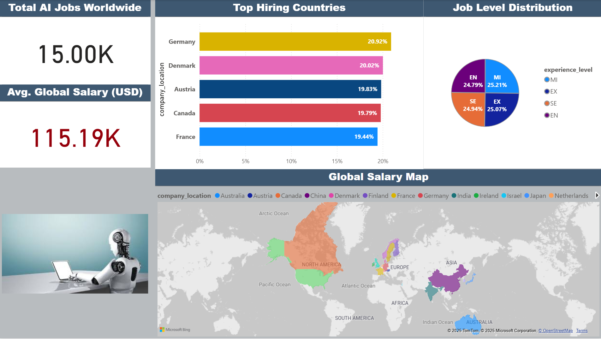

# 🤖 Power BI Project: Global AI Job Market & Salary Trends 2025

## 📌 Project Overview

This Power BI project analyzes the **Global AI Job Market & Salary Trends in 2025**, based on a synthetic dataset containing over **15,000 AI-related job listings** from more than **50 countries**. The dashboard explores various facets of the AI job ecosystem, including **salary distribution**, **experience levels**, **remote work patterns**, **company size**, **geographic trends**, and **skills demand**.

The purpose of this analysis is to provide valuable insights to job seekers, market researchers, recruiters, and business strategists on the dynamics of the AI labor market in a rapidly evolving technological landscape.

---

## 📁 Project Structure

```
global-ai-job-market-2025/
 ├── data/
 │   └── main_dataset.csv          # Original dataset CSV file
 ├── report/
 │   └── Global_AI_Jobs_2025.pbix # Power BI dashboard file
 ├── images/
 │   └── dashboard.png             # Dashboard screenshot
 ├── README.md                    # Project documentation
 └── LICENSE                      # Project license (MIT)

```

---

## 📈 Dashboard Preview



---

## 🧮 Dataset Description

- **Title:** Global AI Job Market & Salary Trends 2025
- **Records:** 15,247 job listings
- **Countries Covered:** 20+
- **Format:** CSV
- **Source Type:** Synthetic dataset generated for educational and research purposes

### 🔑 Key Features

- Salary data normalized in USD and original currencies  
- Experience levels: Entry (EN), Mid (MI), Senior (SE), Executive (EX)  
- Company size classification: Small, Medium, Large  
- Remote work ratio: 0 (onsite), 50 (hybrid), 100 (fully remote)  
- Skills demand and education requirements  
- Time-series tracking of job postings  
- Benefits scoring and job description lengths

---

## 🧰 Tools & Techniques

- **Power BI Desktop**
- **Power Query** for:
  - Data type standardization
  - Text cleaning and transformation
  - Currency normalization
- **DAX Measures** for:
  - Average salary by country, role, and experience level
  - Remote work distribution analysis
  - Salary-to-benefit correlation
  - Time-series comparison
- **Data Modeling**:
  - Fact table: Job Listings
  - Dimension tables: Country, Company, Role, Industry, Skills

---

## 🔍 Key Insights from the Dashboard

- 💼 **Senior roles** (SE) dominate job offerings, with **Executive roles** showing the highest average salary.
- 🌎 **United States, India, and Germany** are the top three countries in AI job volume.
- 💰 **Large companies** (>250 employees) tend to offer higher compensation but demand more experience.
- 🏠 **Remote jobs** account for ~35% of all listings, with hybrid models increasing globally.
- 📊 Demand for skills like **Python, TensorFlow, NLP, and LLMs** remains consistently high.
- ⏳ Time-series analysis shows an increase in AI hiring post-Q1, likely driven by GenAI adoption.

---

## 📌 Use Cases

- **📊 Salary Benchmarking**: Compare roles across locations and experience levels  
- **📈 Market Trend Monitoring**: Follow demand changes by industry and time  
- **📍 Geographic Studies**: Relate cost of living to salary offerings  
- **📂 Career Planning**: Identify top-paying roles, required skills, and job types  
- **📉 Business Intelligence**: Understand hiring behavior by company size and region  

---

## 🧭 Future Work

- Add cost-of-living data for adjusted salary comparisons  
- Integrate AI skill trends with Google Trends / StackOverflow data  
- Build ML salary prediction models from Power BI or export  
- Publish an interactive version via Power BI Service with slicers and bookmarks  

---

## 📜 License

- **Dataset License:** The original dataset **Global AI Job Market & Salary Trends 2025** is licensed under **[CC0: Public Domain](https://creativecommons.org/publicdomain/zero/1.0/)**.  
  This means the data is free to use without restrictions.

- **Project Files:** All analysis, Power BI reports, visualizations, and documentation created in this project are released under the **[MIT License](LICENSE)**.

---

## 📬 Contact

Created by **Yuhe Yang** – [yyh-shift@outlook.com]  
Feel free to open issues, fork this repo, or collaborate.

---

## 💡 Suggested Discussion Topics

- What factors most influence AI job salaries in your analysis?  
- Interesting remote work trends you've observed  
- Best visualization techniques for employment datasets  
- ML model ideas using this dataset  
- Geographic patterns and skill clusters that surprised you  

